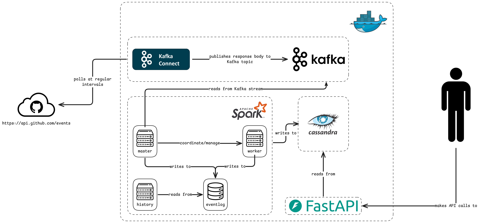

# Lely Data Engineering Assignment

Real-Time GitHub Event monitoring with Apache Kafka, PySpark, Cassandra, and FastAPI


## Table of Contents

- Architecture
- Prerequisites & Installation
- Running the Spark Jobs
- FastAPI endpoints
- Unit testing


## Architecture

This project contains a Kafka and PySpark streaming architecture. A [docker-compose](./docker-compose.yaml) file initializes (with all required dependencies):
- Kafka Cluster
- Spark Cluster
- Cassandra NoSQL database
- FastAPI Rest API

A custom-made-by-me [Kafka HTTP-Connector](https://github.com/StefanNieuwenhuis/kafka-custom-http-connector) polls the GitHub API every `[n]` milliseconds (see [.env.example](./.env.example)) and publishes the response body to a predefined Kafka topic. The connector is installed in [./kafka-connect/custom-plugins/kafka-custom-http-connector](https://github.com/StefanNieuwenhuis/lely-data-engineering-assignment/tree/c959ea1c208118b5416335c8c06ee6206f5b9d72/kafka-connect/custom-plugins/kafka-custom-http-connector), and the config is in [./kafka-connect/connectors-config/kafka-custom-http-connector.json](https://github.com/StefanNieuwenhuis/lely-data-engineering-assignment/blob/c959ea1c208118b5416335c8c06ee6206f5b9d72/kafka-connect/connectors-config/kafka-custom-http-connector.json)

A manually triggered Spark job reads from the Kafka Stream and computes the average time between pull requests, and the total number of events, grouped by event type. This job can be handled by orchestrators like Apache AirFlow, or DataBricks. It writes to Apache Cassandra, a noSql database which the FastAPI Rest API consumes.




## Prerequisites

This setup assumes an up-to-date instance of Docker Desktop with docker compose is installed. If not, please follow the installation instructions on the [offical Docker website](https://docs.docker.com/get-started/get-docker/).

> Please make sure you can run commands with `root` privileges on your machine!

## Getting Started

> Note: You can go through [docker-compose](./docker-compose.yaml) to get a deep understanding of the application.

### Clone the repository and cd into the folder

```bash
git clone https://github.com/StefanNieuwenhuis/lely-data-engineering-assignment.git
cd lely-data-engineering-assignment
```

### Initialize .env

```bash
mv .env.example .env
```

#### Optional
Open `.env` and edit values like `GITHUB_AUTH_TOKEN_CLASSIC`

### Run docker-compose.yaml

```bash
docker compose up -d
```

### Submit the Spark Streaming Job

In a new terminal window, run:

```bash
docker exec -it spark-master spark-submit /opt/spark/scripts/main.py
```

This triggers the spark streaming jobs that compute the:

- Average time between pull requests for a given repository.
- Total number of events grouped by the event type.

> Note: this runs as continuous task, but its designed to also be scheduled in e.g. Apache Airflow or DataBricks.

### (optional) Kafka Ingestion

To check incoming events in Kafka, run:

```bash
docker exec --workdir /opt/kafka/bin/ -it kafka ./kafka-console-consumer.sh --bootstrap-server localhost:9202 --topic github-events --from-beginning
```

### Call FastAPI Rest endpoints

> Swagger docs are found here http://localhost:8000/docs

#### Get the average time between pull requests for a given repository

> Note: Since PullRequestEvents are **EXTREMELY** sparse, I added a dummy repository `StefanNieuwenhuis/TestRepository`.

```bash
curl -X 'GET' \
  'http://localhost:8000/v1/avg_pr_interval/StefanNieuwenhuis/TestRepository' \
  -H 'accept: application/json'
```

### Get the total number of events grouped by event type

```bash
curl -X 'GET' \
  'http://localhost:8000/v1/agg_event_counts?offset_minutes=10' \
  -H 'accept: application/json'
```

## Where does the code live?

### PySpark processors

The PySpark processors are responsible for consuming data from the Kafka Stream, computing average PR interval and total number of events (grouped by event type), and writing to Cassandra.

- All pipelines are orchestrated in [/spark/scripts/main.py](https://github.com/StefanNieuwenhuis/lely-data-engineering-assignment/blob/c959ea1c208118b5416335c8c06ee6206f5b9d72/spark/scripts/main.py).
- All configurations, processors, schemas, sinks and sources are in [./spark/app/src](https://github.com/StefanNieuwenhuis/lely-data-engineering-assignment/tree/c959ea1c208118b5416335c8c06ee6206f5b9d72/spark/app/src)

#### Average PR interval

The processor is found in [./spark/app/src/processors/pr_interval_processor.py](https://github.com/StefanNieuwenhuis/lely-data-engineering-assignment/blob/c959ea1c208118b5416335c8c06ee6206f5b9d72/spark/app/src/processors/pr_interval_processor.py)


#### Total number of events grouped by event type (a.k.a. Aggregated Event Counts)

The processor is found in [./spark/app/src/processors/aggregate_event_counts_processor.py](https://github.com/StefanNieuwenhuis/lely-data-engineering-assignment/blob/c959ea1c208118b5416335c8c06ee6206f5b9d72/spark/app/src/processors/aggregate_event_counts_processor.py)

### FastApi Rest endpoints

- FastAPI is run from [./fastapi/app/main.py](https://github.com/StefanNieuwenhuis/lely-data-engineering-assignment/blob/c959ea1c208118b5416335c8c06ee6206f5b9d72/fastapi/app/main.py)
- The app sources are in [./fastapi/app/src](https://github.com/StefanNieuwenhuis/lely-data-engineering-assignment/tree/c959ea1c208118b5416335c8c06ee6206f5b9d72/fastapi/app/src)
- Average PR interval router: [./fastapi/app/src/routers/avg_pr_interval.py](https://github.com/StefanNieuwenhuis/lely-data-engineering-assignment/blob/c959ea1c208118b5416335c8c06ee6206f5b9d72/fastapi/app/src/routers/avg_pr_interval.py)
- Total number of events grouped by event type router: [./fastapi/app/src/routers/agg_event_counts.py](https://github.com/StefanNieuwenhuis/lely-data-engineering-assignment/blob/c959ea1c208118b5416335c8c06ee6206f5b9d72/fastapi/app/src/routers/agg_event_counts.py)

## Unit testing

### PySpark

```bash
docker exec -it spark-master pytest /opt/spark/tests -v
```

### FastAPI

```bash
docker exec -it fastapi pytest /opt/fastapi/tests -v
```
